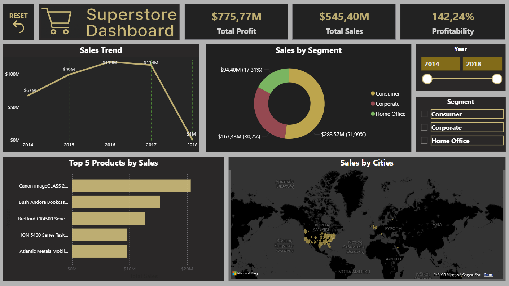
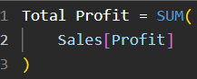
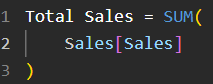
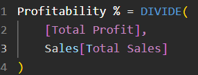
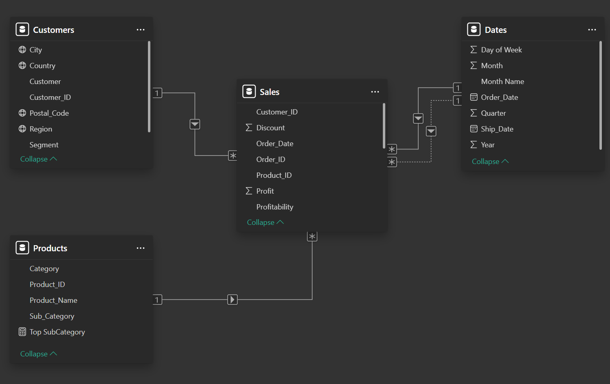

# 📊 Superstore Sales Dashboard

## 🖼️ Final Dashboard

---

## 🎯 Dashboard Objective

The goal of this project is to analyze sales performance from the Superstore dataset using **Power BI**.  
This single-page executive dashboard provides key insights into total sales, profitability, customer segments, and product trends from **2014 to 2018**, enabling data-driven business decisions.

---

## 📌 Key Components

- ⚙️ **SQL** used for initial cleaning, transformation, and modeling  
- 🧰 **Power Query** applied for calculated columns like `Year`, `Month`, `Weekday`, `Ship Delay`  
- 🧠 **DAX** measures for custom metrics and time intelligence  
- 📊 **Power BI** visualizations with filters, bookmarks, and custom formatting  

---

## 📊 Core Visualizations

| Visual Type            | Purpose                                |
|------------------------|----------------------------------------|
| **Card**               | Shows profit, sales, profitability (%) |
| **Line Chart**         | Sales trend over years                 |
| **Donut Chart**        | Sales distribution by segment          |
| **Clustered Bar Chart**| Top 5 products by sales                |
| **Map**                | Sales by city                          |
| **Slicers**            | Filters for `Year` and `Segment`       |
| **Reset Button**       | Clears all slicers via bookmark        |

---

## 📐 DAX Measures

> ℹ️ Below are some of DAX calculations used in the dashboard. Screenshots are provided instead of plain code for visual clarity.

### KPI Cards
**Total Profit**

**Total Sales**

**Profitability**

---

## 💡 Highlighted Insights

- 🥇 **2016** was the best year in sales with over **$118K**
- 🧾 **Technology** products dominate the top-selling list
- 🧑‍💼 **Corporate** segment accounted for over 50% of total sales
- 🏙️ Major revenue contributors include **New York** and **Los Angeles**

---

## 💼 Business Solutions

- 📉 Identify underperforming cities for potential market campaigns  
- 🎯 Focus marketing efforts on the **Corporate** and **Technology** segments  
- 🚚 Improve shipping performance to reduce delays and increase customer satisfaction  
- 🔍 Use profitability and YoY trends to support **strategic sales planning**

---

## 🧩 Data Modeling Process

To ensure a clean and efficient data model for Power BI:

1. **Initial Data Import**  
   The dataset was first loaded into Power BI as a flat table from a cleaned SQL export.

2. **Table Splitting**  
   To improve performance and model clarity, the large Superstore table was logically split into:
   - A **Sales table** containing transactional data
   - Supporting **lookup tables** for `Customers`, `Products`, and `Dates`.

3. **Power Query Transformations**
   - Removed duplicates from dimension tables.
   - Extracted additional time intelligence fields: `Year`, `Month`, `Weekday` from `Order Date`.
   - Created a `Ship_Delay` column.

4. **Data Relationships Defined**
   Relationships were created in **Model View**:
   - One-to-many between lookup tables and main table.
   - Keys defined based on `Order_ID`, `Customer_ID`, `Product_ID`, and `Order_Date`.

5. **Star Schema**
   The final structure follows a star schema for optimal performance.

### 🖼️ Model View Preview

