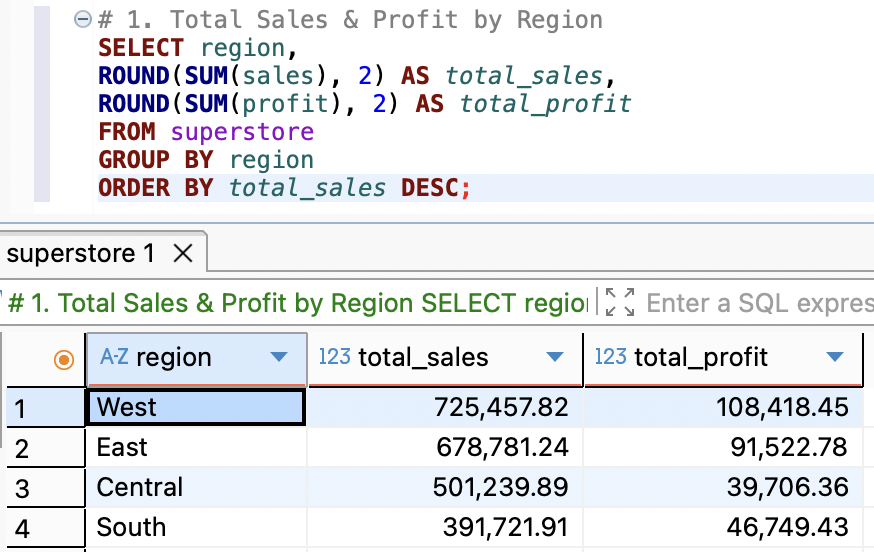
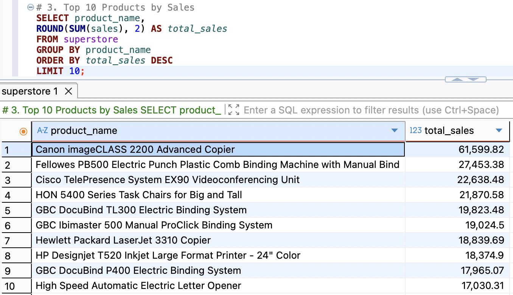
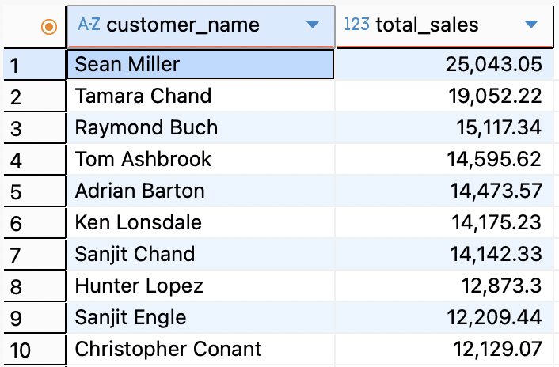

# 📁 SQL Analysis – Superstore Dataset

## 🎯 Purpose

This folder contains all SQL-related files used to analyze the **Superstore** dataset.  
The analysis focuses on extracting actionable business insights related to **regional sales**, **product performance**, and **customer value** using SQL queries on structured order-level data.

---

## 📂 Folder Contents

```
sql/
├── scripts/               # Scripts for schema creation and analytical queries
├── images/                # Screenshots of query results used for README visuals
└── README.md              # This file
```

---

## 🔑 Key SQL Queries

Here are the main queries executed as part of this analysis:

---

### 1. 🌍 Total Sales & Profit by Region

```sql
SELECT region,
       ROUND(SUM(sales), 2) AS total_sales,
       ROUND(SUM(profit), 2) AS total_profit
FROM superstore
GROUP BY region
ORDER BY total_sales DESC;
```



---

### 2. 🏆 Top 10 Products by Sales

```sql
SELECT product_name,
       ROUND(SUM(sales), 2) AS total_sales
FROM superstore
GROUP BY product_name
ORDER BY total_sales DESC
LIMIT 10;
```



---

### 3. 💳 Top 10 Customers by Total Sales

```sql
SELECT customer_name,
       ROUND(SUM(sales), 2) AS total_sales
FROM superstore
GROUP BY customer_name
ORDER BY total_sales DESC
LIMIT 10;
```



---

## 📸 Visuals

Query results are visualized in this `README.md` using screenshots stored under [`sql/images/`](images/).

---

## 📌 Next Steps

- Connect the cleaned SQL dataset to Power BI  
- Create dashboards for regional analysis, product trends, and customer segmentation  
- Add interactivity to compare profit vs sales across time and categories
